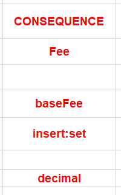

# Common Pitfalls

### 1. Formula in rule cell not working

When entering formulas in rule cells that act on previously set properties of models, users may find that the computation isn’t working. A common misstep is to write the formula like this:

```text
fee.getBaseFee() - fee.getDiscount()
```

When, for example the base fee, column has been defined like this:



When declaring a model, and not assigning a variable name, the default name to access the model in formulas is to add “Fact” to the end of the model name. Therefore, `fee.getBaseFee()` should be `feeFact.getBaseFee`. The reason for this appended word is for the rule processor to use terminology pertaining to rules.

### **2. Merge header not being used**

Users sometimes copy the same value in multiple rows in the same column. To save time, the MERGE header should be set to TRUE for that column so that copying multiple times is not necessary.

### **3. String comparison not working**

Another common pitfall, is that users may find that string comparisons aren’t properly functioning. A common reason is forgetting to include modifiers such as `lc` \(lower case\) or `uc` \(upper case\).

### **4. Property not updating**

The Logicdrop Rules API allows users to process rules from multiple Decision Tables at once. This often results in Models from one table being referenced in another. When this happens, a common issue is that a property belonging to a model that was defined in Decision Table A, is not being modified in Decision Table B. For example, say that a property called name of model Person is defined in Decision Table A. In Decision Table B, say the user wants to modify this name and the used `insert:set` but it is not working. To fix this, the user must use `modify:set` instead.

### **5. Excel formatting issues**
When defining a cell as decimal, the header `FORMAT` must be set to decimal. However, users may forget to also format the cell as decimal via Excel also. This allows the cell to be readable as a decimal, but also so the rules can process the value as a decimal as well.


