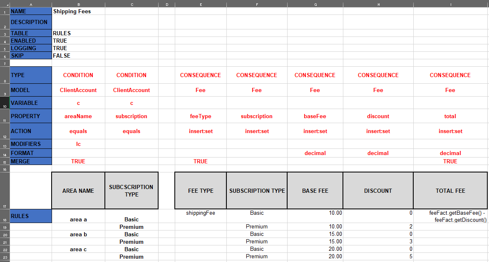
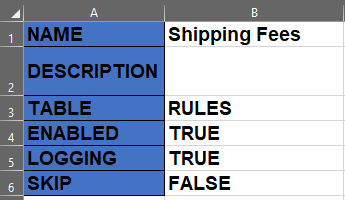
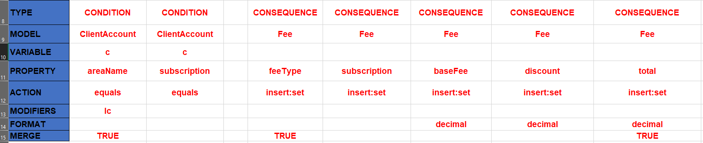
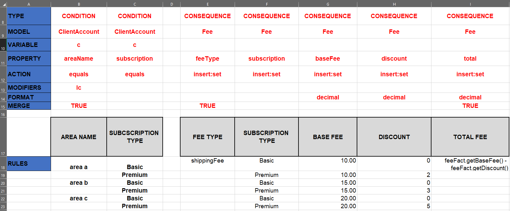

# Creating a Workbook

The Logicdrop Sparks Platform offers an API for ingesting a Decision Table and turning a Microsoft Excel workbook into rules that can be executed against input data \(facts\). This Decision Table format is unique to Logicdrop and is simple and easy-to-use for any end-user to create and modify. This section will walk through how to use this Decision Table format by leading you through an example.

## Overview

To demonstrate the process of creating a decision table, we will create a simple example to perform the calculation of Shipping Fees. The example may be [downloaded here](workbook-examples.md).

The rules created from this Decision Table specify how to create a total Shipping Fee based on a client’s area and their subscription type.

The Sparks Decision Table format has three sections:

1. **Table Headings:** Information that describes the Decision Table and values that determine whether to run the rules on this table.
2. **Column Headings:** Information that describes each condition or consequence.
3. **Rules:** Values that each rule uses to match and compare against.

These sections and the necessary values to input for each are described in further detail in the sections below.

## Table Headings

At the top of the decision table are several information headings to fill out:

1. **Name**: The decision table name.
2. **Description**: \(Optional\) description for this decision table.
3. **Table**: The type of table, default value is “Rules”
4. **Enabled**: A Boolean flag to set if rules should be created off this table _and_ processed.
5. **Logging**: A Boolean flag to set if detailed logging is needed.
6. **Skip**: A Boolean flag to set if rules should not be created from this table.

In the case of a business user creating a Decision Table for Shipping Fees, the appropriate values are shown in the image above.

## Column Headings

After this, the headings governing the logic for the decision table begin.

Each of these headings apply to each column of the table:

1. **Type:** Specifies whether this column is a CONDITION or CONSEQUENCE.
2. **Model:** User created types to govern rules. Think of Classes in programming \(more on this in the Models and Properties section below\).
3. **Variable**: \(Optional depending on the action\) the name of the variable to modify or create.
4. **Property:** Name of the property of the model to modify or set. Think of member variables in programming \(more on this in the User-Types and Properties section below\).
5. **Action:** The type of evaluation to perform \(more on this in the Actions section below\).
6. **Modifiers:** \(Optional\) Add additional conditions to the action, like specifying string comparisons should be in lower-case.
7. **Format:** \(Optional\) Used for types like numbers and strings, can be used to specify if the result should be formatted as a decimal, word should be upper/lower case, etc.
8. **Merge:** \(Optional\) A Boolean flag to set if the content of the rule cell should propagate across all following empty rows.

For an example, we can read through one column and translate what it means. In the first column, the user defines a Condition, where we are doing a lower-case cast string comparison against the `areaName` property of the model `ClientAccount`. We are setting merge to “true”, because we want the string we compare against to be used for all blank rows below.

## Models and Properties

User-types, also known as Models in the Decision table, are user created types that serve as classes that the rules can act on. Properties are specific attributes of that User-Type. Think of Classes and Member variables. In the shipping fees example, User-Types are ClientAccount and Fee. ClientAccount is a class that holds data about the client who ordered the item, and what can be calculated based on that. In this example’s case, the property that is used is the area name of the user as well as subscription type of the user, such as Basic or Premium. We also have the Fee User-Type. This class holds the properties base fee \(based on the client’s area\), the subscription fee \(based on the client’s subscription type\), and the total.

## Actions

Actions are evaluations to perform on the properties of User-Types. Depending on whether the column is a condition or consequence, the list of possible actions differs. The following are some of the possible actions for conditions:

1. **Equals/not equals/less than/etc.:** Basic string/integer comparisons of a property’s value against another property or constant.
2. **Expression:** Use this action if you want to write equations pertaining to this property in the rule cell.
3. **Contains:** If the property is a set or list, you can use this to check if the value is contained in that set or list.

The following are some of the possible actions for consequences:

1. **Set:** Set the value of a property inside a model
2. **Modify:** Change the value of an existing property or fact inside a model.
3. **Put**: Put an entry into a map inside a model.
4. **Add**: Add an entry to a list inside a model.
5. **Insert:** Insert a fact into a model.


For the consequences, the actions “modify” and “insert” can be combined with the other actions. For example, “insert:set” is commonly used to insert a new property into a Model set its value.


## Rules

Finally, we have the rules section, where the user can define values to match or compare against and set the consequences for those conditions. For reference, here is the full rule section and column headers from the sample Decision Table above \(the grey bold boxes are purely cosmetic and used for user readability\):

Let’s walk-through the first row of the rules so we can see how the column headers integrate with the rules themselves:

1. If we look at the first row of rules and read the first column’s headings from top to bottom, we can see that it defines a condition: where we want the `areaName` of the `ClientAccount` to be equal to “area a” using a lower-case comparison.
2. The second column defines another condition, the subscription of `ClientAccount` must be equal to “Basic”. Both these conditions must be true for the rule to trigger the consequences.
3. The first consequence column defines a Fee object, where we set the `feeType` to be equal to `shippingFee`. Indicating that this Fee we are processing is used for computing shipping fees.
4. The next column similarly sets the subscription type in the Fee object to “Basic”.
5. Finally, we get to the actual fee columns. The first one is the `baseFee` column, where we can specify a base fee based on what area the client is in. In this case, the client would be in Area A, therefore we want the rule to set the base fee as $10.00.
6.  The next column, we specify the discount which changes based on what level of subscription the client has. In this case, the client has a basic subscription, therefore we say they get no discount on their shipping fee.
7.  In the last column, we set the total fee. In the rule cell, we want to perform a calculation based on the values of previous columns, so we input an equation. The equation used here subtracts the discount from the `baseFee` to calculate the final total shipping amount. Importantly, we set the MERGE heading to TRUE because we want to apply this formula to every row below. This is useful so that we don’t have to repeat the formula on every rule row.

This same logic applies to all following rows of rules.

Using this Decision Table format, you can easily start processing complex rules with Logicdrop’s Sparks API.

