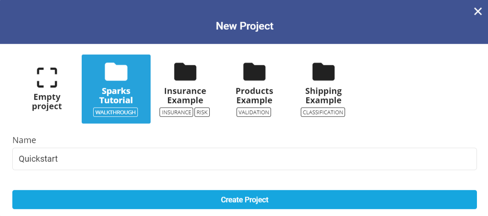
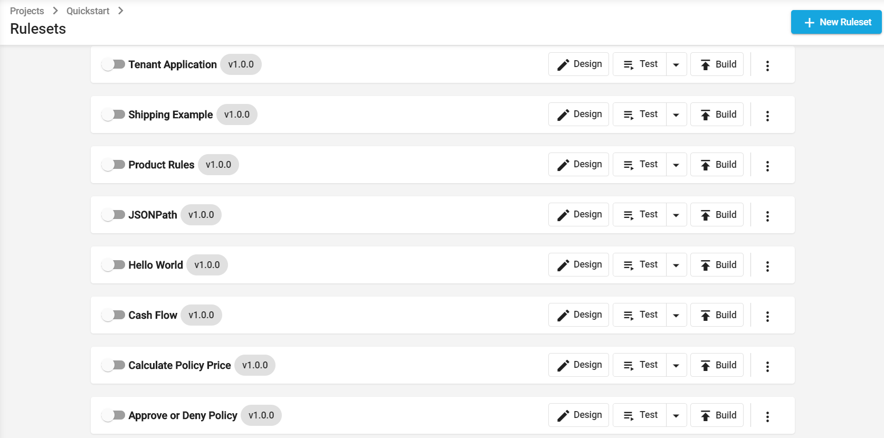
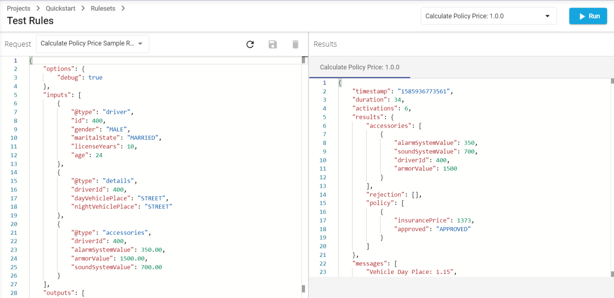
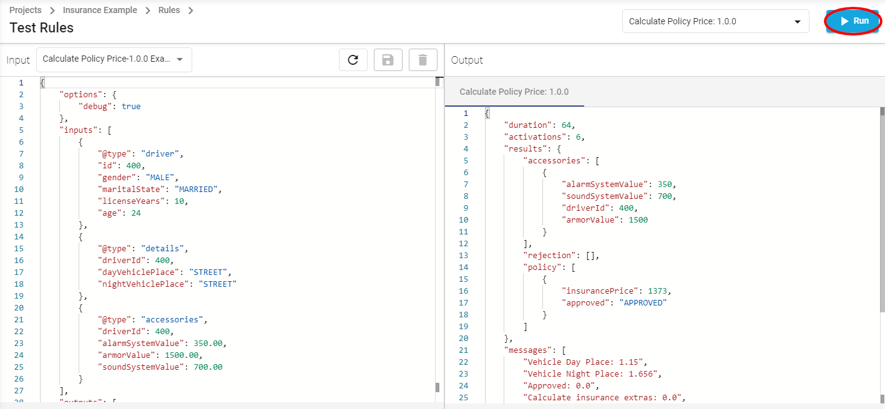

# 5-Minute Quickstart

## Create an account

In order to start using the Logicdrop Sparks Platform, you will need to register with a valid email and fill out a few details.

1. Go to [**https://logicdrop.com/signup**](https://logicdrop.com/signup/).
2. Fill out the form or use your Google account to signup.
3. Approve the email notification that will be sent to you \(make sure to check that it did not arrive in your spam folder\). 
4. Once approved, you will be redirected to the client portal: [**https://sparks.logicdrop.io**](https://sparks.logicdrop.io)
5. Enter a client identifier \(lowercase with dashes instead of spaces\). This is a unique id for your account, and may not be changed once created.
6. Enter your client details and optional coupon code, if one was provided to you.
7. Finally, submit the form and your new account will be provisioned.

## Create a new project


If it is not open already, navigate to the client portal: [**https://sparks.logicdrop.io**](https://sparks.logicdrop.io)


Click the **New Project** button in the upper right hand corner.

Select "**Sparks Tutorial**" from the list of templates and provide a project name. Let's call it _**"Quickstart"**_

Click **Create Project**, then click the newly created project label to open it.

## Ruleset

Once your project is open, click **Rules** from the left hand navigation menu.


A **Ruleset** in Sparks is a group of business rules, or logical statements, which work together to achieve a common task. Examples include calculating a shipping cost, scoring a lead, or approving an insurance application.

[→ More on Rules](compute-intro.md)



A **Container** in Sparks is a running instance of a **Ruleset**, at a specific version. Each container starts a unique endpoint which can be used to execute the rules within.

[→ More on Containers](compute-intro.md#containers)



Note that if a container fails to publish due to errors in a rule, the previous version will be used when that container is started or executed.


## Testing Rules

Now, to test our rules. Click the **Test** button for the _**Calculate Policy Price**_ item.

In the right corner click **Run.**


The **Test Rules** page is a convenient way to test your running rulesets, and even compare results against multiple running containers.



Because rule execution uses “serverless” technology, if a ruleset is executed for the first time and no instances are available it needs to provision the instance first. This can initially take a short amount of time \(&lt; 30s\). Once an instance is available, execution performance should be normal.


For convenience, input requests may be saved and recalled. Try changing the input data on the left then click Run again after each change.

* Change **alarmSystemValue** to a different amount.
* Change **maritalState** to _SINGLE_
* Change age from 24 to 17.

In the right-hand pane you can now view the output results. Look for the "policy" fact in the result set. It should reveal an `approved` status of true and a calculated `insurancePrice`. These values are entirely calculated by the defined rules.

## Closing

You have now created, deployed, and tested a running web service to calculate insurance pricing for a fictional underwriter. This service is running in the cloud and can easily scale to tens of thousands of requests or more.

We hope this small preview has been helpful in showing a glimpse of some Sparks Platform functionality. Next, we recommend continuing to learn about [Business Rules Engines and their terminology](compute-intro.md), and then continue through the [more in depth areas](sparks-guides/authoring-decision-tables/) of the documentation.

More advanced users and developers will find it useful to read the API documentation on how to achieve each of these steps though our comprehensive [REST API](https://docs.logicdrop.io).

