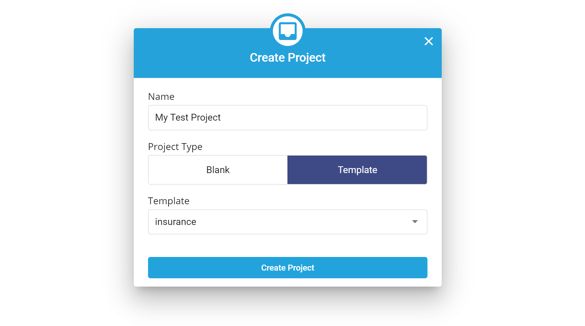
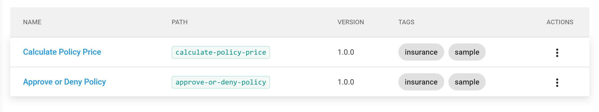
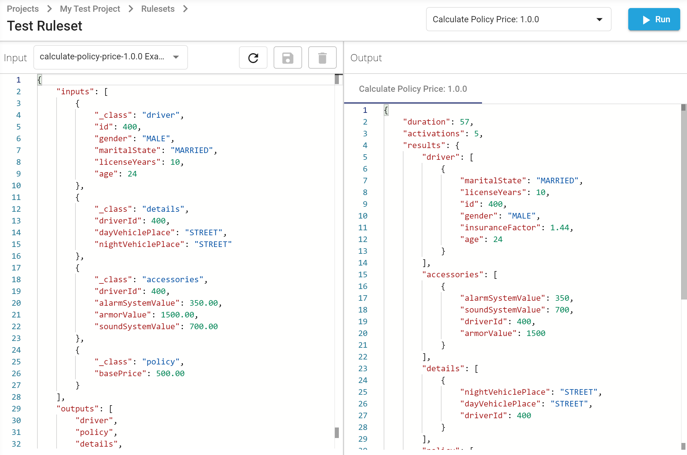

# 5-Minute Quickstart

## Create an account

In order to start using the Logicdrop Sparks Platform, you will need to register with a valid email and fill out a few details.

1. Go to [**https://logicdrop.com/signup**](https://logicdrop.com/signup/).
2. Fill out the form or use your Google account to signup.
3. Approve the email notification that will be sent to you \(make sure to check that it did not arrive in your spam folder\). 
4. Once approved, you will be redirected to the Sparks Portal: [**https://sparks.logicdrop.io**](https://sparks.logicdrop.io)
5. Enter a client identifier \(lowercase with dashes instead of spaces\). This is a unique id for your account, and may not be changed once created.
6. Enter your client details and optional coupon code, if one was provided to you.
7. Finally, submit the form and your new account will be provisioned.

## Create a new project


If it is not open already, navigate to the Sparks Portal: [**https://sparks.logicdrop.io**](https://sparks.logicdrop.io)


Click the **New Project** button

Provide a project name, set the project type to **Template,** and select “insurance” from the drop-down.



Click **Create Project**, then click the newly created project label to open it.

## Publish a ruleset

Once your project is open, click **Rules** from the left hand navigation menu.


A **Ruleset** in Sparks is a group of business rules, or logical statements, which work together to achieve a common task. Examples include calculating a shipping cost, scoring a lead, or approving an insurance application.

[→ More on Rules](compute-intro.md)




Click the **Calculate Policy Price** Ruleset to open it.

You are now taken to the hope page of the ruleset. On the first tab, the **Containers** for the ruleset are listed:



A **Container** in Sparks is a running instance of a **Ruleset**, at a specific version. Each container starts a unique endpoint which can be used to execute the rules within.

[→ More on Containers](compute-intro.md#containers)


Click the **Publish** button on the default `1.0.0` container for our ruleset. The latest version of all the rules in this container will then be be compiled and automatically started. Once published, the container can be started or stopped from this interface.


Note that if a container fails to publish due to errors in a rule, the previous version will be used when that container is started or executed.


## Testing a ruleset

Now, to test our rules. Click **Test Ruleset** in the upper right-hand corner of the open **Calculate Policy Price** Ruleset.



The **Test Ruleset** page is a convenient way to test your running rulesets, and even compare results against multiple running containers.


Note that _at least one_ container must be running to use the Test Ruleset page


To run a ruleset, a container must be **Executed**. This means that data is passed in as inputs to a request to the running container, the rules are fired, and any modified or newly created data by the rules are returned back.

For convince, input requests may be saved and recalled. In this example, we will now select the stored “**calculate-policy-price**” input from the Input drop-down on the left hand pane. This loads a JSON object describing a 24-year-old male driver and some additional facts about their vehicle accessories and base policy.

Now, click **Run** and the inputs will be sent to the running container.

In the right-hand pane you can now view the output results. Look for the "policy" fact in the result set. It should reveal an `approved` status of true and a calculated `insurancePrice`. These values are entirely calculated by the defined rules.

### Testing Different Inputs

Next, let's make some changes to the input data:

```text
{
    "inputs": [
        {
            "_class": "driver",
            "id": 400,
            "gender": "MALE",
            "maritalState": "SINGLE",
            "licenseYears": 2,
            "age": 18
        },
        {
            "_class": "details",
            "driverId": 400,
            "dayVehiclePlace": "STREET",
            "nightVehiclePlace": "STREET"
        },
        {
            "_class": "accessories",
            "driverId": 400,
            "alarmSystemValue": 350.00,
            "armorValue": 1500.00,
            "soundSystemValue": 700.00
        }
    ],
    "outputs": [
        "policy",
        "rejection"
    ]
}
```

Click **Run.** The returned policy should now show newly calculated prices.

Some other things to try:

* Change `gender` from MALE to FEMALE
* Change `alarmSystemValue` to a different amount

## Closing

You have now created, deployed, and tested a running web service to calculate insurance pricing for a fictional underwriter. This service is running in the cloud and can can easily scale to tens of thousands of requests or more.

We hope this small preview has been helpful in showing a glimpse of some Sparks Platform functionality. Next, we recommend continuing to learn about [Business Rules Engines and their terminology](compute-intro.md), and then continue though the [more in depth areas](authoring-decision-tables/) of the documentation.

More advanced users and developers will find it useful to read the API documentation on how to achieve each of these steps though our comprehensive [REST API](https://docs.logicdrop.io).

